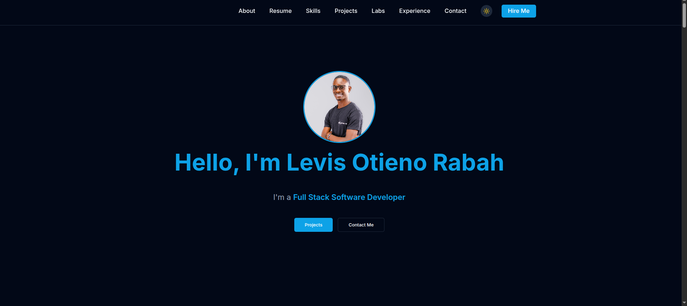

# Levis Rabah Portfolio


# Step 3: Install the necessary dependencies.
npm i

# Step 4: Start the development server with auto-reloading and an instant preview.
npm run dev
```

## What technologies are used

- Vite
- TypeScript
- React
- shadcn-ui
# Levis Rabah Portfolio


# Step 3: Install the necessary dependencies.
npm i

# Step 4: Start the development server with auto-reloading and an instant preview.
npm run dev

## What technologies are used

- Vite
- TypeScript
- React
- shadcn-ui
- Tailwind CSS
  
## Screenshots

Place screenshots under `public/screenshots/` (create the folder if it doesn't exist), then update the filenames below if needed.

### Home Page


### Resume Section


### Projects Section


### Lab Challenges Section


### Contact Section


